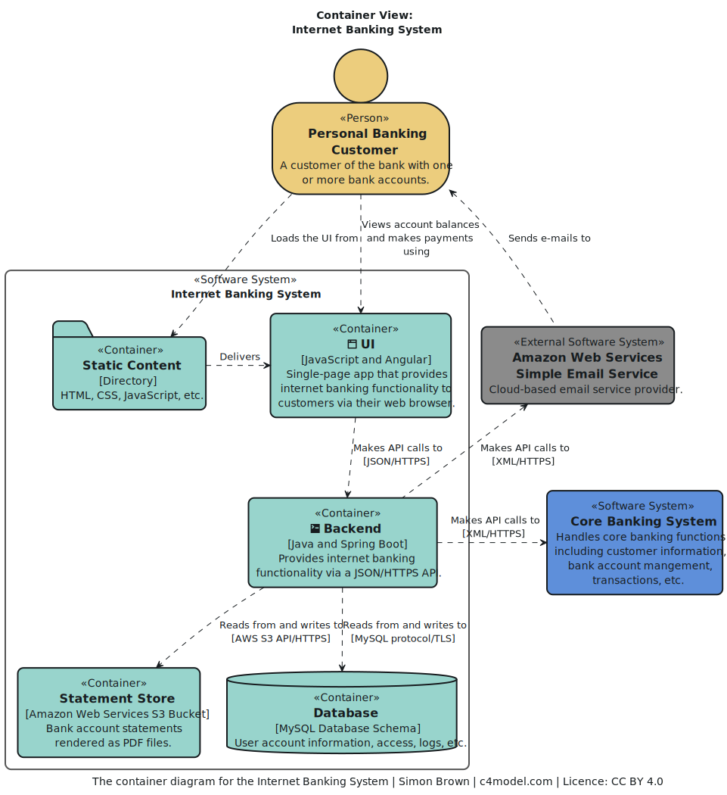
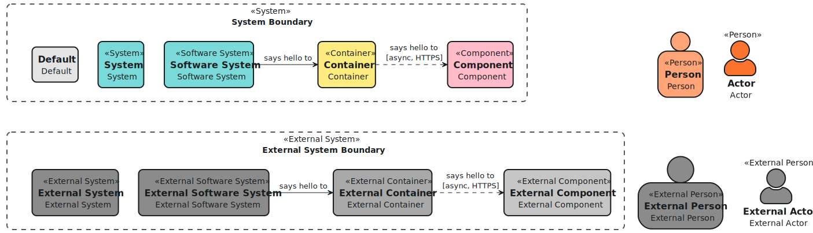
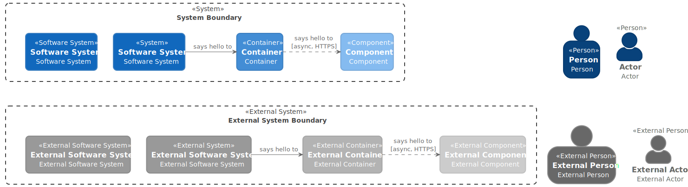
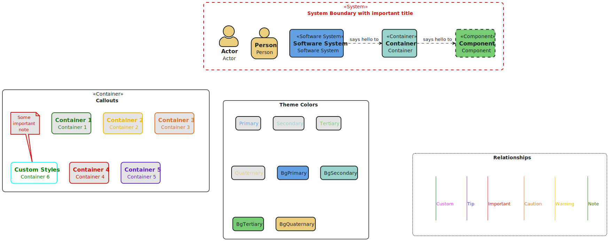
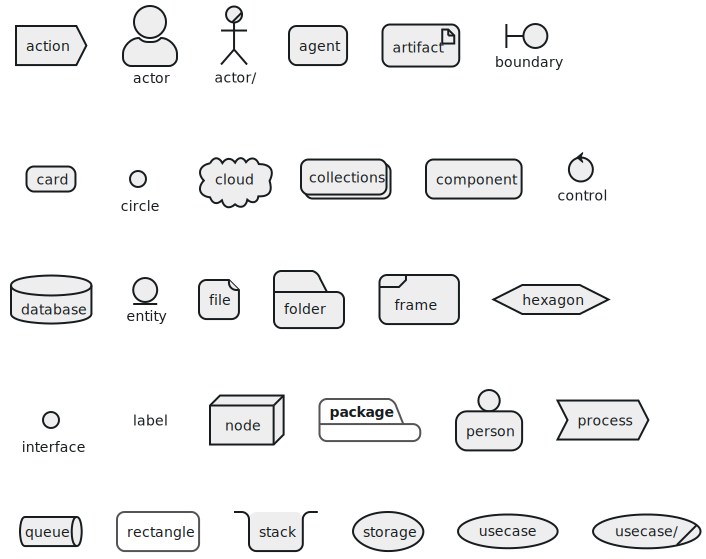

# PlantUML Themes: Retro Coast

The Retro Coast theme is a [PlantUML](https://plantuml.com/) theme featuring a coastal-inspired color palette.
It provides customizable stereotypes for [C4 model diagrams](https://c4model.com/) and general styling.

Please note that this is not a theme for [C4-PlantUML](https://github.com/plantuml-stdlib/C4-PlantUML).
Instead, Retro Coast styles PlantUML's native elements, which can then be further customized using stereotypes
such as `Person`, `System`, `Container` or `Component`.

## Examples

### Container View

### Custom Theme Colors

### Using Color Palatte for Classic C4 Model Colors

### Stereotypes and Inline Colors

### Basic Elements

