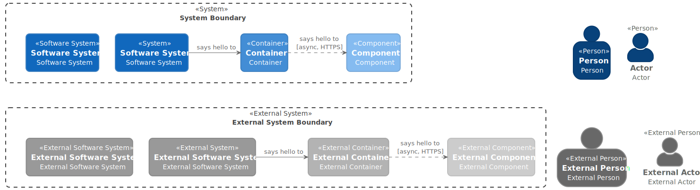

# PlantUML Themes: Retro Coast

The Retro Coast Theme is a [PlantUML](https://plantuml.com/) theme featuring a coastal color palette.
It provides customizable stereotypes for [C4 model diagrams](https://c4model.com/) and general styling.

## Examples

### Retro Coast C4 Model

### Retro Coast C4 Model with Classic Colors

